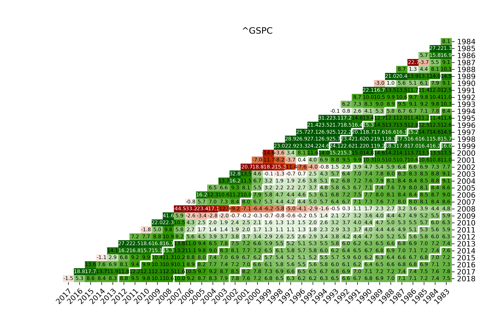

# Python for Stock Market Savings Plan Calculations
With the jupyter-notebook in this repository you can determine average returns of arbitrary stocks and funds. The notebook was used at the Workshop [Sparen am Aktienmarkt - Eine Zeitserienanalyse mit Python](https://events.ccc.de/congress/2018/wiki/index.php/Session:Sparen_am_Aktienmarkt_-_Eine_Zeitserienanalyse_mit_Python) at 35C3 in Leipzig.

For example, for an exchange traded funds based on the *S&P500*, the output will look like this for the years between 1983 and 2018:

